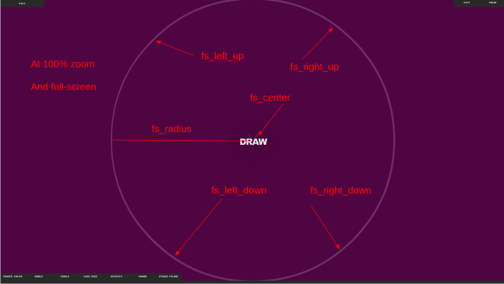
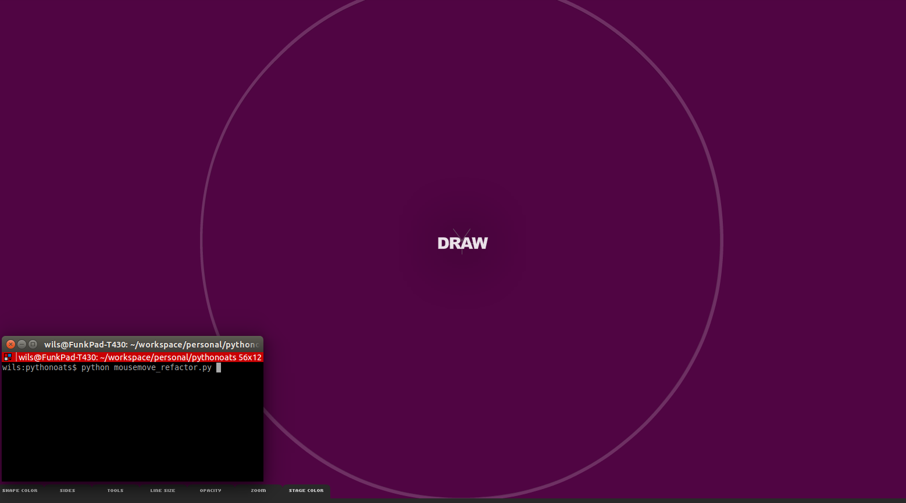

# pythonoats
python mouse-controller for myoats.com 

## Getting Started/ Basics

## WARNING:  this uses a python script to control your actual mouse. This means a few things.
- You won't be able to do anything else while you are running a script.
- If something goes wrong and you end up with...
  - an infinite loop
  - the mouse gets outside of the myoats window
- ... then the mouse might go click/do things you don't want it to.
- SO MAKE SURE YOU UNDERSTAND HOW TO ALT+TAB to switch windows quickly and CTRL+C to kill a script running in terminal. 

SO RUN AT YOUR OWN RISK. If you run this in, say, a gmail tab, it will be clicking/dragging all the things in the world. It might click and send emails, delete things... who knows. 

Eventually I'll add in some additional safeguards like a global timeout (nothing longer than 60 seconds), but that doesn't exist yet. 

### Step 0:  Install pymouse
follow instructions and install: 
[https://github.com/SavinaRoja/PyUserInput](https://github.com/SavinaRoja/PyUserInput)

### Figuring out your screen's coordinates.
To start out with, we need to determine the coordinate system/etc of your
screen. Here's how I did it (Ubuntu/Mac. YYMV with Windows.) 

1) Open up a command line (terminal) and type `python` and hit enter.
This opens up the python interactive console, or REPL.

2) Copy/paste this and hit enter. 
```
from pymouse import PyMouse
m = PyMouse()
```

3) You can now move your mouse with python! python console, type
```
m.move(500,500)
```
This should magically move your mouse to the coordinates (500,500) on your
screen. 

Play around with the coordinates to find the points in this screenshot and
replace what's already in mousemove_refactor.py (currently lines 11-15)


Note that fs_left_up, fs_left_down, fs_right_up, and fs_right_down are slowly
going to be deprecated. Now that I'm doing everything with respect to the
center/radius, they aren't necessary. 

### Configured? Let's go! 

To run this, open up a terminal and the full-screen view of myoats.
When you want to run whatever methods you have, just write
```
$ python mousemove_refactor.py
```
and hit enter. Your mouse will start drawing all over the place.
Keep your terminal small and in the corner of the screen. 




## This needs a LOT of explaning.

This is a python script that controls your mouse to procedurally generate
designs on myoats.com 

My portfolio is [here](http://www.myoats.com/users/Purejenius/designs)
All designs in there were created with these functions. 


## Some Notable Functions / The basics

- This uses pymouse for controlling your mouse to run a script. 
- I recommend opening myoats in full screen. 
- The general behavior pattern is:
    - Function creates a list of pymouse commands
    - These are passed to `run_commands()` 
        - release=True indicates whether mouse will be lifted up at end of the
        pattern
        - run_commands checks to make sure the coordinate is within the myoats
        radius (function `is_in_circle()`)
        - if it doesn't, it will switch that coordinate to one at the same angle of the largest radius


### I shouldn't need this.

#### draw_circle()
draws a circle. You can skew a circle by X and Y, as well as decide to only draw
X% of the circle. 

#### squiggles()
houndstooth pattern

#### square()
a square ... I think this is deprecated in favor of `square_slope()`

### square_slope()
draw a parrallelogram(sp)

### percent_of_cmds

For any arbitrary set of commands, return % percent of commands. 
Also useful for re-ordering commands... 
e.g. if you pass (0.7,0.3), it would change
`[1,2,3,4,5,6,7,8,9,0]` to `[7,8,9,0,1,2,3,4,5,6]`

### square_grid

Draw a grid of squares. I added in a "draw_all_points" variable because I was 
intentionally only having x% of the commands run. Because it looks nice. 
[example](http://www.myoats.com/comments.aspx?p=0&wd=531711)

### square_changes

randomly change side length of squares and fill up the circle with 
squares and partial squares
[example](http://www.myoats.com/comments.aspx?p=0&wd=531711)

### parabolas

this might be broken, I need to review.  Make some parabolas. 

### random 

draw random circles... idk. I should't include this in the full refactor. 

### hemispheres

make some hemispheres using `percent_of_cmds`

### triangle_from_points

Make triangle by passing in 3 points. I have to iterate over it twice
because myoats stopped registering my mouse movements for the first passover.
Your results may vary.

### triangle

Generate points for equalateral triangle at coordinates x,y with side lenght
side. upsidedown=False will.. make... it upside down. 

### midpoint

Get the midpoint of a line segment

### serpinski 

Serpinski gaskgets! go K levels deep. 
I have a bunch of randomness thrown in for fun. Your results may vary. 
But you can make pretty things

[example](http://www.myoats.com/comments.aspx?p=0&wd=531589)


### random_triangles

make random serpinski triangles within a given arclength of the drawing area. 


### cad,run_squares,building,multiple_squares

works in progress. gotta clean this up. 
[ cad example ](http://www.myoats.com/comments.aspx?p=0&wd=531913)
[building example](http://www.myoats.com/comments.aspx?p=0&wd=531906)
[ uhh... one of these example ](http://www.myoats.com/comments.aspx?p=0&wd=531911)

